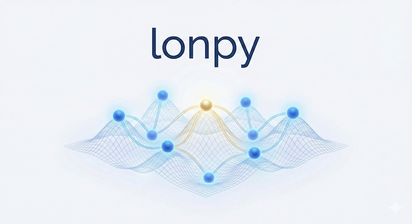

<div align="center">
    
</div>

[](https://pypi.org/project/lonpy/)
[](https://www.python.org/downloads/)
[](https://colab.research.google.com/drive/1Ujl48ffgHg9ck1Hueh59s65OR3Q3BG99?usp=sharing)

**Local Optima Networks**

lonpy is a Python library for constructing, analyzing, and visualizing Local Optima Networks (LONs) for both continuous and discrete optimization problems. LONs provide a powerful way to understand the structure of fitness landscapes, revealing how local optima are connected and how difficult it may be to find global optima.

## Features

- **Continuous Optimization**: Basin-Hopping sampling for continuous fitness landscapes
- **Discrete Optimization**: Iterated Local Search (ILS) sampling for combinatorial problems
- **Built-in Problems**: OneMax, Knapsack, Number Partitioning, and custom problem support
- **LON Construction**: Automatic construction of Local Optima Networks from sampling data
- **CMLON Support**: Compressed Monotonic LONs for cleaner landscape analysis
- **Rich Metrics**: Compute landscape metrics including funnel analysis and neutrality
- **Beautiful Visualizations**: 2D and 3D plots with support for animated GIFs

## Installation

```bash
pip install lonpy
```

Or install from source:

```bash
git clone https://github.com/agh-a2s/lonpy.git
cd lonpy
pip install -e .
```

## Quick Start

### Continuous Optimization

```python
import numpy as np
from lonpy import compute_lon, LONVisualizer

# Define an objective function
def rastrigin(x: np.ndarray) -> float:
    return 10 * len(x) + np.sum(x**2 - 10 * np.cos(2 * np.pi * x))

# Construct the LON
lon = compute_lon(
    rastrigin,
    dim=2,
    lower_bound=-5.12,
    upper_bound=5.12,
    n_runs=20,
    n_iterations=500,
    seed=42
)

metrics = lon.compute_metrics()
print(f"Number of optima: {metrics['n_optima']}")
print(f"Number of funnels: {metrics['n_funnels']}")
print(f"Global funnels: {metrics['n_global_funnels']}")

# Visualize
viz = LONVisualizer()
viz.plot_2d(lon, output_path="lon_2d.png")
viz.plot_3d(lon, output_path="lon_3d.png")
```

### Discrete Optimization

```python
from lonpy import compute_discrete_lon, OneMax, Knapsack, NumberPartitioning

# OneMax problem (maximize number of 1s in a bitstring)
problem = OneMax(n=20)
lon = compute_discrete_lon(problem, n_runs=100, seed=42)

metrics = lon.compute_metrics()
print(f"Number of optima: {metrics['n_optima']}")
print(f"Number of funnels: {metrics['n_funnels']}")

# Knapsack problem
knapsack = Knapsack(
    values=[60, 100, 120, 80, 90],
    weights=[10, 20, 30, 15, 25],
    capacity=50
)
lon = compute_discrete_lon(knapsack, n_runs=100, seed=42)

# Number Partitioning problem
npp = NumberPartitioning(n=15, k=0.5, seed=42)
lon = compute_discrete_lon(npp, n_runs=100, seed=42)
```

## Compressed Monotonic LONs (CMLONs)

CMLONs are a compressed representation where nodes with equal fitness that are connected get merged. This provides a cleaner view of the landscape's funnel structure.

```python
# Convert LON to CMLON
cmlon = lon.to_cmlon()

# Analyze CMLON-specific metrics
cmlon_metrics = cmlon.compute_metrics()
print(f"Global funnel proportion: {cmlon_metrics['global_funnel_proportion']}")
```

## Advanced Configuration

### Continuous Sampling (Basin-Hopping)

```python
from lonpy import BasinHoppingSampler, BasinHoppingSamplerConfig

config = BasinHoppingSamplerConfig(
    n_runs=50,              # Number of independent runs
    n_iterations=1000,      # Iterations per run
    step_size=0.05,         # Perturbation size
    step_mode="percentage", # "percentage" (of domain) or "fixed"
    hash_digits=4,          # Precision for identifying optima
    seed=42                 # For reproducibility
)

sampler = BasinHoppingSampler(config)

# Define search domain
domain = [(-5.12, 5.12), (-5.12, 5.12)]

# Run sampling
lon = sampler.sample_to_lon(rastrigin, domain)
```

### Discrete Sampling (Iterated Local Search)

```python
from lonpy import ILSSampler, ILSSamplerConfig, OneMax

config = ILSSamplerConfig(
    n_runs=100,                     # Number of independent ILS runs
    non_improvement_iterations=100, # Stop after no improvement
    perturbation_strength=2,        # Number of random moves per perturbation
    first_improvement=True,         # Use first improvement hill climbing
    seed=42                         # For reproducibility
)

sampler = ILSSampler(config)
problem = OneMax(n=20)
lon = sampler.sample_to_lon(problem)
```

## Documentation

For full documentation, visit: [https://agh-a2s.github.io/lonpy](https://agh-a2s.github.io/lonpy)

## Contributing

Contributions are welcome! Please feel free to submit a Pull Request.
