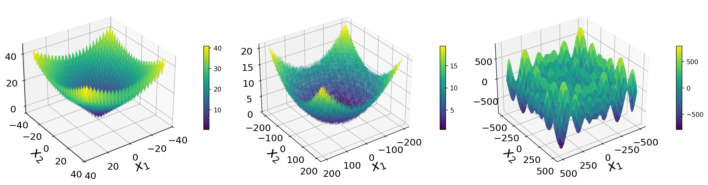
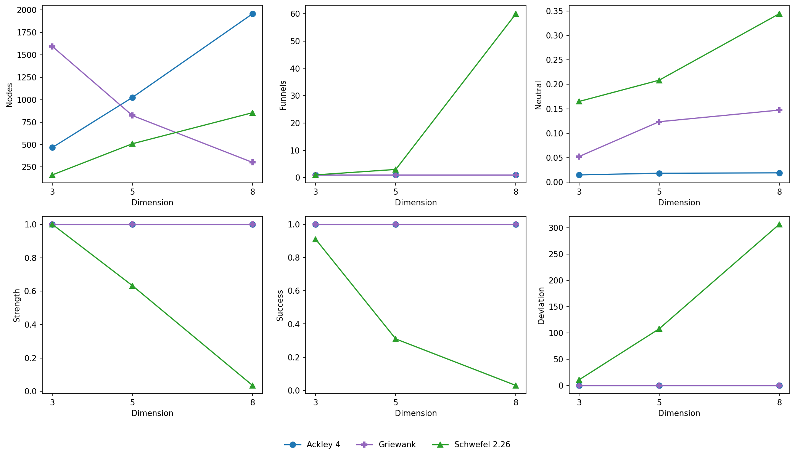
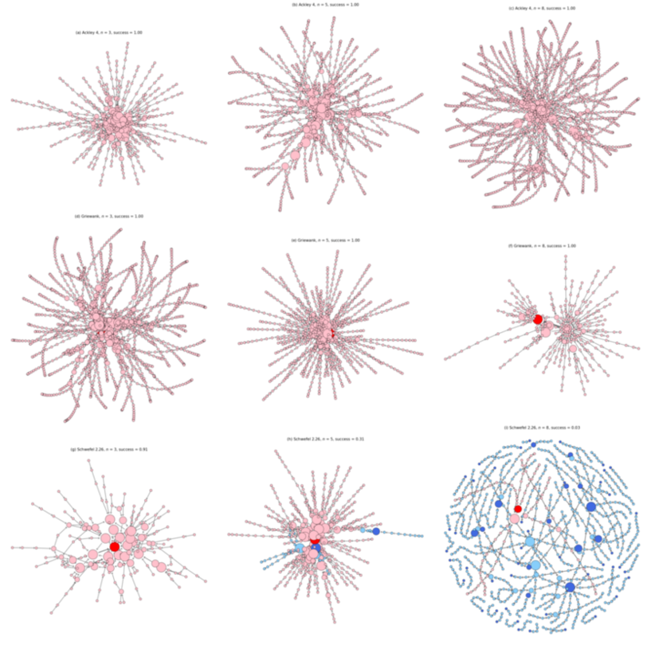
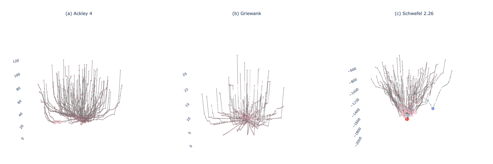
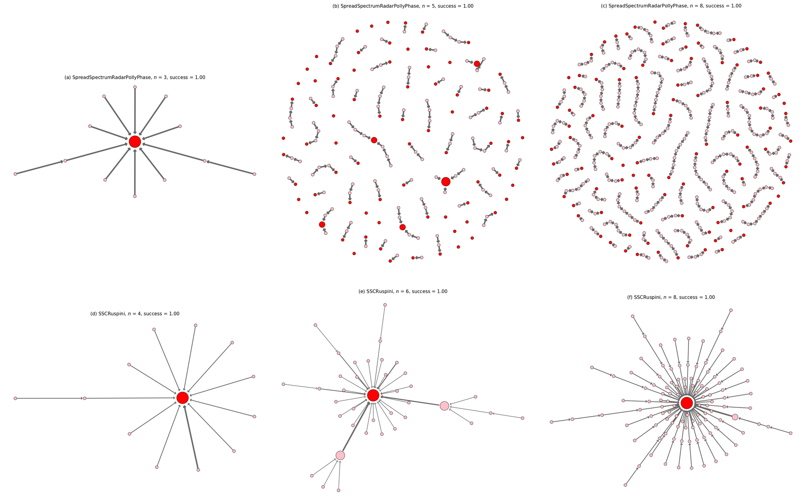

# Reproducing Figures from BIOMA 2020

This directory contains scripts that reproduce figures from the following paper using `lonpy`:

> Contreras-Cruz, M.A., Ochoa, G., Ramirez-Paredes, J.P. (2020).
> **Synthetic vs. Real-World Continuous Landscapes: A Local Optima Networks View.**
> In: Filipič, B., Minisci, E., Vasile, M. (eds) *Bioinspired Optimization Methods and Their Applications. BIOMA 2020.*
> Lecture Notes in Computer Science, vol 12438. Springer, Cham.
> <https://doi.org/10.1007/978-3-030-63710-1_1>

The goal is to validate the `lonpy` implementation by reproducing the key figures from this paper.

## Test Functions

Defined in [`problems.py`](problems.py):

| Function | Domain | Description |
|---|---|---|
| Ackley 4 | [-35, 35] | Multi-modal, non-separable |
| Griewank | [-200, 200] | Many local optima with regular structure |
| Schwefel 2.26 | [-500, 500] | Deceptive global structure |
| Spread Spectrum Radar Polly Phase | [0, 2&pi;] | Real-world radar design problem |
| SSC Ruspini | [0, 200] | Sum-of-squares clustering on Ruspini dataset |

## Reproduced Figures

### Figure 1 - Fitness Landscapes ([`fig1.py`](fig1.py))

3D surface plots of the three synthetic benchmark functions (Ackley 4, Griewank, Schwefel 2.26) in 2D.

```bash
uv run examples/bioma/fig1.py
```



### Figures 2 & 3 — CMLON Networks and Metrics ([`fig3.py`](fig3.py))

Constructs CMLONs for the three synthetic functions across dimensions 3, 5, and 8. Produces:

- **Figure 2** (`fig2.png`) — Metrics comparison across dimensions.
- **Figure 3** (`fig3.png`) — 3×3 grid of 2D CMLON network visualizations.

```bash
uv run examples/bioma/fig3.py
```





### Figure 4 — 3D CMLON Visualizations ([`fig4.py`](fig4.py))

Interactive 3D CMLON plots (fitness as Z-axis) for the three synthetic functions at dimension 5.

```bash
uv run examples/bioma/fig4.py
```



### Figure 5 & 6 — Real-World Problem CMLONs ([`fig6.py`](fig6.py))

2D CMLON network plots for the two real-world problems:

- **Figure 5** (`fig5.png`) — Metrics comparison across dimensions.
- **Figure 6** (`fig6.png`) — 2×3 grid of 2D CMLON network visualizations.

```bash
uv run examples/bioma/fig6.py
```



